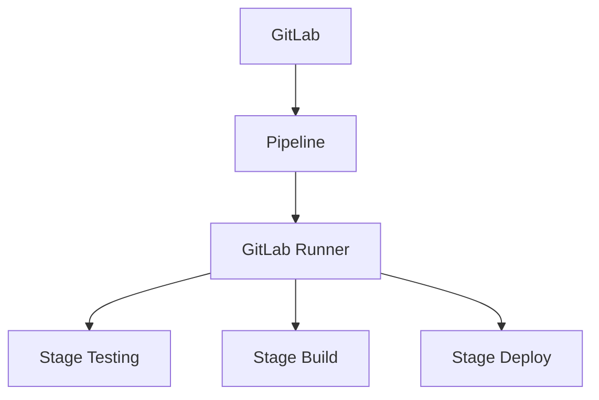
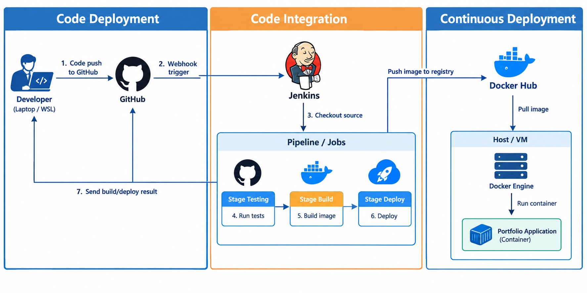

# CI/CD Pipeline Configuration

This section documents the CI/CD pipelines I configured for my projects.

The first two projects use a **GitLab-based CI/CD workflow**. The overall design follows three major stages:

1. **Code Deployment**
2. **Code Integration**
3. **Continuous Deployment**

The same pipeline pattern was applied to two projects, with each project using its own source repository, runner jobs, build process, and deployment target.

I also implemented a separate CI/CD workflow using **Jenkins + GitHub**. The architecture follows the same overall idea while replacing GitLab CI/CD and GitLab Runner with Jenkins.

---

## 1. GitLab CI/CD — Projects 1 & 2

### Pipeline Architecture

The following architecture represents the CI/CD setup used by the two projects.

```mermaid
flowchart LR

    DEV["Developer"] -->|"1. Code push"| GL["GitLab"]

    DEVOPS["DevOps / Pipeline Config"] -->|"3. Define .gitlab-ci.yml"| GL

    GL -->|"4. GitLab trigger pipeline"| PIPE["GitLab Pipeline"]

    PIPE -->|"5. Check / select job"| RUNNER["GitLab Runner"]

    RUNNER -->|"6. Execute jobs"| JOBS["Pipeline Jobs"]

    JOBS --> TEST["Stage Testing"]
    TEST -->|"Test successfully"| BUILD["Stage Build"]
    BUILD -->|"Build image"| IMG["Docker Image"]
    IMG -->|"Push image"| DH["Docker Hub"]

    JOBS -->|"7. Execute deployment"| DEPLOY["Stage Deploy"]
    DEPLOY -->|"8. SSH to host"| HOST["Host / VM"]
    DH -->|"Pull image"| HOST
    HOST -->|"Run container"| APP["Application"]

    JOBS -->|"8. Send results"| GL
```



### Three-Part Pipeline Model

```text
+-------------------------+
|      Code Deployment    |
+-------------------------+
            |
            v
+-------------------------+
|      Code Integration   |
+-------------------------+
            |
            v
+-------------------------+
| Continuous Deployment   |
+-------------------------+
```

The pipeline can be viewed as:

```text
Developer
    |
    | git push
    v
 GitLab
    |
    | trigger
    v
GitLab Pipeline
    |
    | execute jobs
    v
GitLab Runner
    |
    +--> Testing
    |
    +--> Build Docker Image
    |
    +--> Push Image to Docker Hub
    |
    +--> Deploy through SSH
              |
              v
            Host
              |
              v
       Run Application
```

---

## 2. Source Code and Pipeline Trigger

The workflow starts when the developer pushes code to GitLab.

```text
1. Code push to GitLab
        |
        v
    GitLab Repository
        |
        v
2. Pipeline trigger
```

The CI/CD pipeline is defined in the repository using:

```text
.gitlab-ci.yml
```

This file describes the stages, jobs, conditions, scripts, and deployment workflow.

A simplified structure is:

```yaml
stages:
  - test
  - build
  - deploy
```

The exact commands can differ between projects depending on the application technology and deployment requirements.

---

## 3. Code Analysis and Testing

Before deployment, the pipeline performs automated checks.

```text
GitLab
   |
   v
Code Analysis
   |
   v
Stage Testing
   |
   +---- success ----> Stage Build
   |
   +---- failure ----> Stop pipeline
```

The testing stage is important because the deployment stage should only execute after the required checks have completed successfully.

The two GitLab projects use the same general pattern:

```text
Source Code
    |
    v
Code Analysis
    |
    v
Automated Tests
    |
    v
Build
    |
    v
Deploy
```

---

## 4. GitLab Runner

The GitLab Runner is responsible for executing the jobs defined by the pipeline.



The relationship is:

```text
GitLab
   |
   | pipeline
   v
GitLab Runner
   |
   +--> Test
   |
   +--> Build
   |
   +--> Deploy
```

This separates source-code management from job execution.

---

## 5. Docker Image Build

After the testing stage succeeds, the pipeline builds the application as a Docker image.

```text
Stage Testing
      |
      | success
      v
Stage Build
      |
      v
Docker Image
      |
      v
Docker Hub
```

The Docker image provides a consistent deployment artifact.

Instead of deploying source code directly, the deployment process can use a versioned image:

```text
Source Code
    |
    v
Docker Build
    |
    v
Application Image
    |
    v
Docker Hub
```

---

## 6. Continuous Deployment

The deployment stage connects the CI/CD pipeline to the target host.

```text
GitLab Runner
      |
      v
Stage Deploy
      |
      | SSH
      v
Host / VM
      |
      | docker pull
      v
Docker Image
      |
      | docker run
      v
Application Container
```

The deployment flow represented in the original architecture is:

```text
Build and push successfully
           |
           v
      Stage Deploy
           |
           | SSH to host
           v
          Host
           |
           | Pull image
           v
       Docker Image
           |
           | Run container
           v
      Application
```

The host therefore becomes the final execution environment for the application.

---

## 7. Pipeline Result and Feedback

After jobs are completed, the pipeline reports the job result back to GitLab.

```text
Pipeline Jobs
     |
     +---- success
     |
     +---- failure
     |
     v
GitLab Pipeline Result
```

This provides a visible history of pipeline executions and makes it easier to determine whether a commit successfully passed through testing, build, and deployment.

---

## 8. Two GitLab Projects

I applied the same CI/CD concept to **two different projects**.

### Project 1

```text
Developer
   |
   v
GitLab
   |
   v
GitLab Pipeline
   |
   v
GitLab Runner
   |
   +--> Code Analysis
   |
   +--> Stage Testing
   |
   +--> Stage Build
   |
   +--> Stage Deploy
             |
             v
          Host / VM
             |
             v
       Docker Container
```

### Project 2

The second project follows the same overall architecture:

```text
Developer
   |
   v
GitLab
   |
   v
GitLab Pipeline
   |
   v
GitLab Runner
   |
   +--> Code Analysis
   |
   +--> Stage Testing
   |
   +--> Stage Build
   |
   +--> Stage Deploy
             |
             v
          Host / VM
             |
             v
       Docker Container
```

The important difference between projects is the application-specific pipeline configuration. The infrastructure pattern remains consistent.

---

# 9. Jenkins + GitHub CI/CD

For another project, I implemented a similar CI/CD workflow using:

```text
GitHub
Jenkins
Docker
Docker Hub
Host / VM
```

Instead of GitLab Pipeline + GitLab Runner, Jenkins becomes the CI/CD orchestration platform.

## Architecture



### Mermaid Version

The same workflow can also be represented directly in GitBook using Mermaid:

```mermaid
flowchart LR

    DEV["Developer<br/>Laptop / WSL"]
        -->|"1. git push"| GH["GitHub"]

    GH
        -->|"2. Webhook / Trigger"| J["Jenkins"]

    J
        -->|"3. Checkout source"| SRC["Source Code"]

    SRC
        -->|"4. Run tests"| TEST["Stage Testing"]

    TEST
        -->|"5. Build image"| BUILD["Stage Build"]

    BUILD
        -->|"6. Push image"| DH["Docker Hub"]

    DH
        -->|"Pull image"| HOST["Host / VM"]

    HOST
        -->|"Run container"| APP["Application"]

    J
        -->|"Deploy / restart"| HOST

    J
        -->|"7. Build / deploy result"| GH
```



---

## 10. Jenkins Pipeline Stages

The Jenkins pipeline follows the same high-level sequence:

```text
GitHub
   |
   | webhook
   v
Jenkins
   |
   +--> Stage Testing
   |
   +--> Stage Build
   |
   +--> Stage Deploy
```

A Jenkinsfile can define the pipeline as:

```groovy
pipeline {
    agent any

    stages {

        stage('Testing') {
            steps {
                // Run tests
            }
        }

        stage('Build') {
            steps {
                // Build Docker image
            }
        }

        stage('Deploy') {
            steps {
                // Deploy application
            }
        }
    }
}
```

The commands inside each stage depend on the application.

---

## 11. GitHub → Jenkins Trigger

The CI/CD workflow starts with a push to GitHub.

```text
Developer
    |
    | git push
    v
GitHub Repository
    |
    | webhook
    v
Jenkins
```

Jenkins then checks out the repository and starts the configured pipeline.

```text
GitHub
   |
   | webhook
   v
Jenkins
   |
   | checkout
   v
Source Code
```

---

## 12. Jenkins Testing Stage

The first Jenkins stage validates the application.

```text
Jenkins
   |
   v
Stage Testing
   |
   +---- tests pass ----> Stage Build
   |
   +---- tests fail ----> Pipeline stopped
```

Typical responsibilities include:

```text
Dependency installation
        |
        v
Lint / static checks
        |
        v
Unit / integration tests
        |
        v
Test result
```

The actual commands are project-specific.

---

## 13. Jenkins Build Stage

When testing succeeds, Jenkins builds the Docker image.

```text
Stage Testing
      |
      | success
      v
Stage Build
      |
      v
docker build
      |
      v
Docker Image
      |
      v
Docker Hub
```

A simplified build command is:

```bash
docker build -t <image>:<tag> .
```

The resulting image can then be pushed to Docker Hub:

```bash
docker push <image>:<tag>
```

---

## 14. Jenkins Deployment Stage

The deployment stage updates the target host.

```text
Docker Hub
     |
     | docker pull
     v
Host / VM
     |
     | restart / recreate
     v
Application Container
```

One possible deployment flow is:

```bash
docker pull <image>:<tag>

docker stop <container> || true

docker rm <container> || true

docker run -d \
  --name <container> \
  <image>:<tag>
```

The exact deployment commands depend on the application's Docker configuration.

---

## 15. GitLab vs Jenkins + GitHub

The two CI/CD approaches can be described as:

```text
+----------------------+---------------------------+
| GitLab-based         | Jenkins + GitHub         |
+----------------------+---------------------------+
| GitLab Repository    | GitHub Repository        |
| .gitlab-ci.yml       | Jenkinsfile              |
| GitLab Pipeline      | Jenkins Pipeline         |
| GitLab Runner        | Jenkins                  |
| Docker               | Docker                   |
| Docker Hub            | Docker Hub                |
| SSH Deployment       | SSH / Remote Deployment  |
+----------------------+---------------------------+
```

The core delivery pattern remains similar:

```text
Source Control
      |
      v
CI/CD Engine
      |
      v
Testing
      |
      v
Build
      |
      v
Docker Image
      |
      v
Container Registry
      |
      v
Deployment Host
      |
      v
Application
```

The main architectural difference is the CI/CD orchestration layer.

---

## 16. End-to-End Jenkins + GitHub Flow

```text
                    +----------------+
                    |    Developer   |
                    +-------+--------+
                            |
                            | git push
                            v
                    +----------------+
                    |     GitHub     |
                    +-------+--------+
                            |
                            | webhook
                            v
                    +----------------+
                    |    Jenkins     |
                    +-------+--------+
                            |
              +-------------+-------------+
              |             |             |
              v             v             v
        +-----------+ +-----------+ +-----------+
        |  Testing  | |   Build   | |  Deploy   |
        +-----------+ +-----------+ +-----------+
                              |
                              | Docker image
                              v
                      +---------------+
                      |   Docker Hub  |
                      +-------+-------+
                              |
                              | pull image
                              v
                      +---------------+
                      |    Host / VM  |
                      +-------+-------+
                              |
                              | run container
                              v
                      +---------------+
                      |  Application  |
                      +---------------+
```

---

## 17. Why Use CI/CD?

The purpose of these pipelines is to replace repeated manual deployment steps with an automated workflow.

### Manual Deployment

```text
SSH into server
      |
      v
git pull
      |
      v
docker build
      |
      v
docker stop
      |
      v
docker rm
      |
      v
docker run
```

### Automated Deployment

```text
git push
   |
   v
CI/CD Pipeline
   |
   +--> Test
   |
   +--> Build
   |
   +--> Push image
   |
   +--> Deploy
   |
   v
Application updated
```

This gives the projects a repeatable deployment process.

---

## 18. Technologies Used

### GitLab Projects

```text
GitLab
GitLab CI/CD
GitLab Runner
Docker
Docker Hub
SSH
Host / VM
```

### Jenkins + GitHub Project

```text
GitHub
Jenkins
Jenkinsfile
Docker
Docker Hub
SSH / Remote Deployment
Host / VM
```

---

## 19. Summary

Across these projects, I worked with two different CI/CD approaches.

The first approach used:

```text
GitLab
   |
   v
GitLab Pipeline
   |
   v
GitLab Runner
   |
   v
Testing
   |
   v
Build
   |
   v
Docker Hub
   |
   v
Deploy
```

The second approach used:

```text
GitHub
   |
   v
Jenkins
   |
   v
Testing
   |
   v
Build
   |
   v
Docker Hub
   |
   v
Deploy
```

Although the tooling is different, both workflows follow the same fundamental DevOps pattern:

```text
                    Source Control
                         |
                         v
                   CI/CD Trigger
                         |
                         v
                       Test
                         |
                         v
                       Build
                         |
                         v
                   Docker Image
                         |
                         v
                  Container Registry
                         |
                         v
                    Deploy Host
                         |
                         v
                    Application
```

These projects gave me practical experience with source-control triggers, automated testing, Docker image creation, container registries, remote deployment, and CI/CD pipeline configuration.
