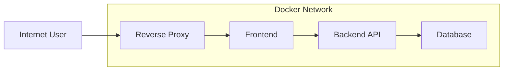
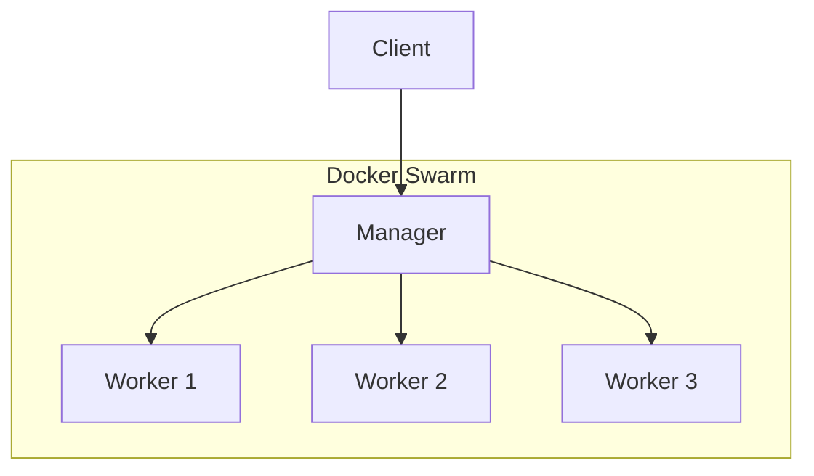
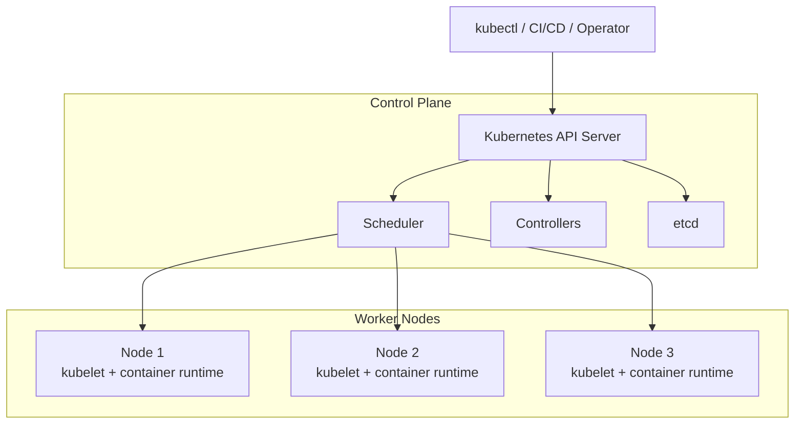
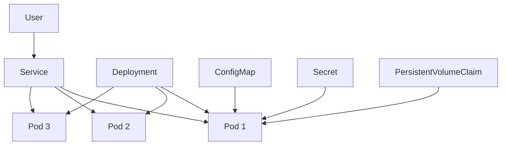
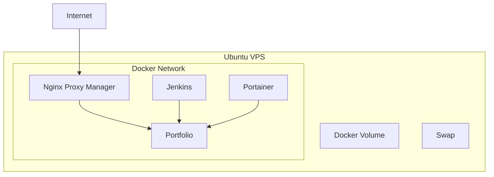
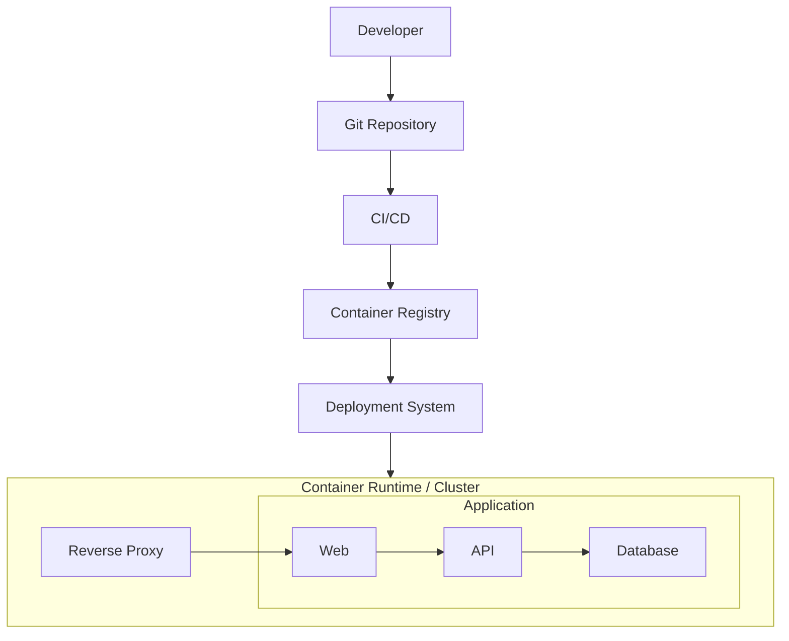

# Container Management (Docker / Docker Compose / Docker Swarm / Kubernetes)

> Notes from my hands-on work with containerized applications, infrastructure labs, CI/CD, and cloud-native projects.

Containerization became one of the most useful parts of my infrastructure workflow.

At first, I mostly used Docker to run a single application:

```text
Application
    |
    v
Dockerfile
    |
    v
Docker Image
    |
    v
Docker Container
```

Then the problem became bigger.

One application was not enough. I needed a frontend, backend, database, reverse proxy, CI/CD service, and persistent storage.

That led me to:

```text
Docker
   |
   +--> Docker Compose
   |
   +--> Docker Swarm
   |
   +--> Kubernetes
```

The goal of this page is not to memorize every command.

The goal is to understand the core model, know which abstraction I am working with, and be able to troubleshoot a broken deployment.

---

# 1. The Container Mental Model

A container is an isolated process running from an image.

Docker Engine uses a long-running daemon (`dockerd`) plus the Docker CLI/API to manage objects such as images, containers, networks, and volumes.

The basic relationship is:

```text
Dockerfile
    |
    | docker build
    v
Docker Image
    |
    | docker run
    v
Docker Container
```

The important distinction is:

```text
Image      = immutable package/template
Container  = running instance of an image
Volume     = persistent data
Network    = connectivity between containers
Registry   = storage/distribution for images
```

A useful way to think about it:

```text
                    Docker Host
                         |
        +----------------+----------------+
        |                |                |
      Image            Network          Volume
        |                |                |
        v                v                v
   Container A      Container B      Persistent Data
```

---

# 2. Dockerfile Fundamentals

A Dockerfile describes how to build an image.

Example:

```dockerfile
FROM python:3.12-slim

WORKDIR /app

COPY requirements.txt .

RUN pip install --no-cache-dir -r requirements.txt

COPY . .

EXPOSE 8000

CMD ["python", "app.py"]
```

The build process:

```bash
docker build -t myapp:1.0 .
```

Run it:

```bash
docker run -d \
  --name myapp \
  -p 8000:8000 \
  myapp:1.0
```

Check it:

```bash
docker ps
curl http://127.0.0.1:8000
```

Inspect the image:

```bash
docker image ls
docker image inspect myapp:1.0
```

Inspect the container:

```bash
docker inspect myapp
```

Enter the container:

```bash
docker exec -it myapp /bin/sh
```

View logs:

```bash
docker logs myapp
docker logs -f myapp
```

---

# 3. Container Lifecycle

The lifecycle I use when debugging is:

```text
Created
   |
   v
Running
   |
   +----> Stopped
   |
   +----> Restarting
   |
   +----> Exited
```

Useful commands:

```bash
docker ps
docker ps -a

docker start myapp
docker stop myapp
docker restart myapp

docker rm myapp
```

For a container that exits immediately:

```bash
docker ps -a
docker logs myapp
docker inspect myapp
```

The first question is always:

```text
Did the process inside the container stay alive?
```

A container is not a virtual machine.

If the main process exits, the container normally exits too.

---

# 4. Ports and Port Mapping

A common beginner mistake is confusing the host port with the container port.

Example:

```bash
docker run -d \
  --name web \
  -p 8080:80 \
  nginx
```

This means:

```text
Host                Container
  |
  | 8080
  v
Docker port mapping
  |
  | 80
  v
Nginx
```

So:

```text
http://localhost:8080
```

reaches:

```text
container:80
```

The syntax is:

```text
-p HOST_PORT:CONTAINER_PORT
```

Check published ports:

```bash
docker ps
docker port web
```

A container can also communicate through a Docker network without publishing a port to the host.

That becomes extremely useful for reverse proxies and private backend services.

---

# 5. Docker Networks

Create a network:

```bash
docker network create app-net
```

Run containers on it:

```bash
docker run -d \
  --name backend \
  --network app-net \
  my-backend:1.0

docker run -d \
  --name frontend \
  --network app-net \
  my-frontend:1.0
```

The frontend can communicate with:

```text
backend:PORT
```

instead of needing to know the container IP.

Inspect:

```bash
docker network ls
docker network inspect app-net
```

A typical application architecture:



The important design idea is:

```text
Public traffic
      |
      v
Reverse Proxy
      |
      v
Private Docker Network
      |
      +--> Frontend
      +--> API
      +--> Database
```

Not every container needs a public port.

---

# 6. Docker Storage

Containers are disposable.

If I store important data only inside the writable container layer:

```text
Container deleted
      |
      v
Data can disappear
```

For persistent data, Docker volumes are normally the preferred mechanism for container-generated persistent data. Bind mounts are useful when the host filesystem itself needs to be directly shared with the container.

## Named Volume

Create one:

```bash
docker volume create postgres-data
```

Use it:

```bash
docker run -d \
  --name postgres \
  -v postgres-data:/var/lib/postgresql/data \
  postgres:18
```

Inspect:

```bash
docker volume ls
docker volume inspect postgres-data
```

Mental model:

```text
Container
    |
    | mount
    v
postgres-data
    |
    v
Persistent storage
```

## Bind Mount

Example:

```bash
docker run -d \
  --name nginx \
  -v ./nginx.conf:/etc/nginx/nginx.conf:ro \
  nginx
```

Use a bind mount when the host path itself is part of the workflow.

---

# 7. Environment Variables and Secrets

A basic container can receive environment variables like:

```bash
docker run -d \
  --name api \
  -e APP_ENV=production \
  -e DATABASE_HOST=db \
  my-api:1.0
```

For local development, this is convenient.

For sensitive values, I avoid hard-coding credentials in images or Git repositories.

For example:

```text
Bad:

DATABASE_PASSWORD=real-password
```

inside source control.

Better:

```text
Application
   |
   v
Secret injection
   |
   v
Runtime configuration
```

For Docker Swarm, Docker-managed secrets are available for sensitive service data, while Docker configs are intended for non-sensitive configuration.

---

# 8. Docker Image Management

Basic image operations:

```bash
docker image ls
docker pull nginx:latest
docker build -t myapp:1.0 .
docker tag myapp:1.0 username/myapp:1.0
docker push username/myapp:1.0
docker rmi myapp:1.0
```

I try to avoid relying on:

```text
latest
```

for production deployments.

A versioned tag is easier to track:

```text
myapp:1.0.0
myapp:1.0.1
myapp:2026-10-03
myapp:<git-sha>
```

Example:

```bash
docker build \
  -t username/myapp:$(git rev-parse --short HEAD) \
  .
```

This creates a direct relationship between:

```text
Git commit
     |
     v
Docker image tag
     |
     v
Deployment
```

That becomes very useful when debugging which version is actually running.

---

# 9. Docker Logging and Cleanup

Check logs:

```bash
docker logs myapp
docker logs --tail 100 myapp
docker logs -f myapp
```

See disk usage:

```bash
docker system df
```

Remove unused objects carefully:

```bash
docker container prune
docker image prune
docker network prune
docker volume prune
```

Or:

```bash
docker system prune
```

I do not blindly run aggressive cleanup on a production machine.

Before deleting anything:

```bash
docker system df
```

Then inspect which object is consuming space.

For a small VPS, container logs and image layers can become a real storage issue.

---

# 10. Docker Compose

When one container became several containers, manually running commands became annoying.

For example:

```text
Nginx
Backend
PostgreSQL
Redis
```

Instead of:

```bash
docker run ...
docker run ...
docker run ...
docker network create ...
docker volume create ...
```

I can define the application stack in a Compose file.

Docker Compose is designed to define and run multi-container applications, including services, networks, and volumes, through a Compose file. The current Compose model is the Compose Specification.

---

# 11. Basic Compose Example

`compose.yaml`:

```yaml
services:

  web:
    image: nginx:1.27
    ports:
      - "8080:80"
    depends_on:
      - api

  api:
    build: ./api
    environment:
      DATABASE_HOST: db
    depends_on:
      - db

  db:
    image: postgres:18
    environment:
      POSTGRES_DB: app
      POSTGRES_USER: app
      POSTGRES_PASSWORD: change-me
    volumes:
      - postgres-data:/var/lib/postgresql/data

volumes:
  postgres-data:
```

Start everything:

```bash
docker compose up -d
```

Check:

```bash
docker compose ps
```

Logs:

```bash
docker compose logs
docker compose logs -f api
```

Stop:

```bash
docker compose down
```

Rebuild:

```bash
docker compose up -d --build
```

---

# 12. Compose Networking

Compose automatically creates a network for the application.

So services can communicate using service names.

Example:

```text
web --> api --> db
```

The API should connect to:

```text
db:5432
```

not:

```text
127.0.0.1:5432
```

Inside the API container:

```text
127.0.0.1
```

means:

```text
the API container itself
```

This is a very common source of connection bugs.

---

# 13. Compose Healthchecks and Dependencies

A common mistake is assuming:

```yaml
depends_on:
  - db
```

means the database is ready for queries.

It controls dependency startup order in the basic form. Compose can wait for a dependency marked `service_healthy` when a healthcheck is defined.

A better example:

```yaml
services:

  db:
    image: postgres:18
    environment:
      POSTGRES_DB: app
      POSTGRES_USER: app
      POSTGRES_PASSWORD: change-me
    healthcheck:
      test: ["CMD-SHELL", "pg_isready -U app -d app"]
      interval: 5s
      timeout: 5s
      retries: 10

  api:
    build: ./api
    depends_on:
      db:
        condition: service_healthy
```

The idea becomes:

```text
Create DB
   |
   v
DB starts
   |
   v
Healthcheck
   |
   | healthy
   v
Start API
```

---

# 14. Compose Profiles

Profiles are useful when I do not want every service in every environment.

For example:

```yaml
services:

  api:
    image: my-api:1.0

  db:
    image: postgres:18

  adminer:
    image: adminer
    profiles:
      - dev
```

Development:

```bash
docker compose --profile dev up -d
```

Production:

```bash
docker compose up -d
```

The service with the `dev` profile is only activated when the profile is selected.

This is useful for:

```text
Development
   |
   +--> API
   +--> DB
   +--> Adminer

Production
   |
   +--> API
   +--> DB
```

---

# 15. Real Case — Compose Application Cannot Reach Database

## Situation

The API container reports:

```text
connection refused
```

My first instinct is not to change random configuration.

I check:

```bash
docker compose ps
docker compose logs api
docker compose logs db
```

Then:

```bash
docker compose exec api getent hosts db
```

If DNS resolves:

```text
db -> container IP
```

then the network relationship is working.

Next:

```bash
docker compose exec api nc -vz db 5432
```

Possible diagnosis:

```text
DNS works
   |
   v
Network works
   |
   v
Port reachable
   |
   v
Application credentials / DB initialization problem
```

Another common diagnosis:

```text
API starts too early
   |
   v
DB not healthy yet
   |
   v
Connection fails
```

Then I add a healthcheck and use:

```yaml
depends_on:
  db:
    condition: service_healthy
```

This is a good example of troubleshooting from the bottom layer upward:

```text
DNS
  ↓
Network
  ↓
TCP Port
  ↓
Application Protocol
  ↓
Credentials
  ↓
Application Logic
```

---

# 16. When Compose Is Not Enough

Compose is excellent for:

```text
Single host
Small application stack
Development
Testing
Simple production deployments
CI environments
```

But eventually I may need:

```text
Multiple hosts
Replicas
Scheduling
Rolling updates
Service discovery
Cluster management
Self-healing
```

That is where Docker Swarm or Kubernetes enters the picture.

---

# 17. Docker Swarm

Docker Swarm mode is built into Docker Engine.

Swarm manages a cluster of Docker daemons and introduces services, replicas, scheduling, overlay networks, and rolling update behavior.

A simplified architecture:



A swarm has:

```text
Manager Nodes
    |
    +--> cluster state
    +--> scheduling
    +--> service management

Worker Nodes
    |
    +--> run service tasks
```

---

# 18. Initialize a Swarm

On the first manager:

```bash
docker swarm init --advertise-addr <MANAGER-IP>
```

Check:

```bash
docker info
docker node ls
```

Generate a worker join command:

```bash
docker swarm join-token worker
```

A worker can then join using the generated command.

Back on the manager:

```bash
docker node ls
```

Example:

```text
ID        HOSTNAME      STATUS   AVAILABILITY   MANAGER STATUS
abc...    manager-01    Ready    Active         Leader
def...    worker-01     Ready    Active
ghi...    worker-02     Ready    Active
```

---

# 19. Swarm Services

Unlike standalone Docker:

```bash
docker run nginx
```

Swarm uses a service abstraction:

```bash
docker service create \
  --name web \
  --publish 8080:80 \
  nginx:1.27
```

Check:

```bash
docker service ls
docker service ps web
```

Scale:

```bash
docker service scale web=3
```

Now the desired state is:

```text
web replicas = 3
```

Swarm tries to maintain that desired state.

---

# 20. Swarm Service Model

Think about:

```text
Service
   |
   +--> Task
   +--> Task
   +--> Task
```

Each task becomes a running container on a node.

Example:

```text
              web service
             replicas = 3
                  |
      +-----------+-----------+
      |           |           |
      v           v           v
  Worker 1    Worker 2    Worker 3
  container   container   container
```

This gives me a much more useful abstraction than manually running containers on three servers.

---

# 21. Swarm Overlay Network

Swarm can use overlay networks to connect services across nodes. Docker also provides an ingress network that supports routing/load-balancing behavior for published services.

Create:

```bash
docker network create \
  --driver overlay \
  app-net
```

Create a service:

```bash
docker service create \
  --name api \
  --network app-net \
  --replicas 3 \
  my-api:1.0
```

Now:

```text
Worker 1
   |
   +--> api task

Worker 2
   |
   +--> api task

Worker 3
   |
   +--> api task

        \

      overlay network

        /

services can communicate
```

---

# 22. Swarm Rolling Updates

One of the useful Swarm features is controlled service updates.

Example:

```bash
docker service update \
  --image my-api:2.0 \
  api
```

You can configure update behavior, including update parallelism, delay, and failure actions.

Conceptually:

```text
Version 1
   |
   | update
   v
Replace tasks gradually
   |
   v
Version 2
```

Instead of:

```text
Stop everything
    |
    v
Deploy everything
```

This can reduce deployment disruption.

---

# 23. Real Case — Swarm Deployment Gets Stuck

## Situation

I update a service:

```bash
docker service update --image my-api:2.0 api
```

Then:

```bash
docker service ps api --no-trunc
```

shows tasks failing.

My troubleshooting sequence:

```bash
docker service ps api --no-trunc
docker service inspect api
docker node ls
```

Then check the node:

```bash
docker ps
docker logs <container>
```

Typical questions:

```text
Can the node pull the image?
Can the container start?
Is the port already in use?
Are CPU/memory constraints blocking placement?
Does the application immediately exit?
```

The key lesson is that a Swarm problem can exist at several levels:

```text
Service
   |
   +--> Scheduling
   |
   +--> Image pull
   |
   +--> Container startup
   |
   +--> Application health
```

I debug in that order instead of treating every failure as "Docker is broken."

---

# 24. Swarm Stack Deployment

A Compose-style file can also be used for a Swarm stack, with Swarm-specific deployment settings.

Example:

```yaml
services:

  web:
    image: nginx:1.27
    ports:
      - "80:80"

    deploy:
      replicas: 3

      update_config:
        parallelism: 1
        delay: 10s

      restart_policy:
        condition: on-failure
```

Deploy:

```bash
docker stack deploy \
  -c compose.yaml \
  myapp
```

Check:

```bash
docker stack ls
docker stack services myapp
docker stack ps myapp
```

Remove:

```bash
docker stack rm myapp
```

---

# 25. Swarm Secrets

A Swarm secret can be created with:

```bash
printf 'super-secret' | docker secret create db_password -
```

List:

```bash
docker secret ls
```

Use it in a service:

```yaml
services:
  db:
    image: postgres:18
    secrets:
      - db_password

secrets:
  db_password:
    external: true
```

The important security idea is:

```text
Secret
   |
   | controlled injection
   v
Service
   |
   v
Container
```

I do not want:

```text
secret
   |
   v
Dockerfile
   |
   v
Image layer
   |
   v
Registry
```

---

# 26. Kubernetes

Kubernetes changes the level of abstraction again.

Kubernetes is a platform for managing containerized workloads and services through declarative configuration and automation. Its concepts include workloads, networking, storage, configuration, security, scheduling, and resource management.

A simplified architecture:



The exact internals are more detailed, but the important idea is:

```text
I declare desired state.

Kubernetes works to make reality match it.
```

---

# 27. Kubernetes Core Objects

The first objects I learned were:

```text
Pod
Deployment
Service
ConfigMap
Secret
Namespace
PersistentVolume / PersistentVolumeClaim
```

A practical application might look like:



---

# 28. Pods

A Pod is the smallest deployable compute object in Kubernetes.

For a simple application:

```text
Deployment
    |
    v
Pod
    |
    v
Container
```

Example:

```yaml
apiVersion: v1
kind: Pod
metadata:
  name: nginx
spec:
  containers:
    - name: nginx
      image: nginx:1.27
      ports:
        - containerPort: 80
```

Create:

```bash
kubectl apply -f pod.yaml
```

Inspect:

```bash
kubectl get pods
kubectl describe pod nginx
kubectl logs nginx
```

Enter:

```bash
kubectl exec -it nginx -- /bin/sh
```

In normal application deployments, I usually work with higher-level workload objects such as Deployments rather than creating long-lived Pods directly.

---

# 29. Deployments

A Deployment manages Pods and ReplicaSets and provides declarative updates for stateless application workloads.

Example:

```yaml
apiVersion: apps/v1
kind: Deployment

metadata:
  name: web

spec:
  replicas: 3

  selector:
    matchLabels:
      app: web

  template:
    metadata:
      labels:
        app: web

    spec:
      containers:
        - name: web
          image: nginx:1.27

          ports:
            - containerPort: 80
```

Apply:

```bash
kubectl apply -f deployment.yaml
```

Check:

```bash
kubectl get deployments
kubectl get replicasets
kubectl get pods
```

Scale:

```bash
kubectl scale deployment web --replicas=5
```

---

# 30. Services

Pods are replaceable.

Their IP addresses should not become a hard-coded dependency.

Kubernetes Services provide a stable network abstraction in front of Pods.

Example:

```yaml
apiVersion: v1
kind: Service

metadata:
  name: web

spec:
  selector:
    app: web

  ports:
    - port: 80
      targetPort: 80

  type: ClusterIP
```

Flow:

```text
Client
   |
   v
Service:80
   |
   +----> Pod 1
   +----> Pod 2
   +----> Pod 3
```

Now the Pods can be replaced while the Service remains stable.

---

# 31. Kubernetes Service Discovery

Within a namespace, applications can usually access a Service using its service name.

For example:

```text
http://web:80
```

Kubernetes also provides DNS records based on Service and Namespace names. A full DNS form is:

```text
<service-name>.<namespace-name>.svc.cluster.local
```

This allows services to communicate without tracking Pod IPs manually.

---

# 32. ConfigMaps and Secrets

A ConfigMap stores non-confidential configuration.

A Secret is intended for confidential data such as passwords, tokens, or keys.

ConfigMap:

```yaml
apiVersion: v1
kind: ConfigMap
metadata:
  name: app-config
data:
  APP_ENV: production
  API_URL: http://api
```

Secret:

```yaml
apiVersion: v1
kind: Secret
metadata:
  name: app-secret
type: Opaque
stringData:
  DB_PASSWORD: change-me
```

Use them in a Deployment:

```yaml
envFrom:

  - configMapRef:
      name: app-config

  - secretRef:
      name: app-secret
```

Conceptually:

```text
Image
  |
  | same image
  v
Deployment

Environment-specific data
  |
  +--> ConfigMap
  |
  +--> Secret
```

This keeps environment configuration separate from the image.

---

# 33. Health Probes

One of the most important Kubernetes concepts is application health.

Kubernetes supports:

```text
Startup probe
Liveness probe
Readiness probe
```

Startup checks whether the application has finished starting.

Liveness helps detect an unhealthy container that should be restarted.

Readiness determines whether the Pod should receive traffic.

Example:

```yaml
livenessProbe:
  httpGet:
    path: /health
    port: 8080
  initialDelaySeconds: 10
  periodSeconds: 10

readinessProbe:
  httpGet:
    path: /ready
    port: 8080
  periodSeconds: 5
```

The difference is important:

```text
Liveness
    |
    +--> "Should this container be restarted?"

Readiness
    |
    +--> "Should this Pod receive traffic?"
```

---

# 34. Real Case — Pod Is Running but Users Get Errors

This is a classic issue.

I run:

```bash
kubectl get pods
```

and see:

```text
web-abc123    1/1   Running
```

It looks healthy.

But requests fail.

Next:

```bash
kubectl get svc
kubectl describe svc web
kubectl get endpoints web
```

I also check:

```bash
kubectl describe pod web-abc123
kubectl logs web-abc123
```

Possible problem:

```text
Pod = Running
but
Readiness = False
```

Then:

```text
Service
   |
   X
Pod not ready
```

This explains why:

```text
"container is running"
```

does not necessarily mean:

```text
"application is ready to receive traffic"
```

---

# 35. Kubernetes Resource Requests and Limits

For larger clusters, resource management becomes important.

A Pod can define CPU and memory requests and limits.

Example:

```yaml
resources:

  requests:
    cpu: "100m"
    memory: "128Mi"

  limits:
    cpu: "500m"
    memory: "512Mi"
```

Requests influence scheduling: the scheduler uses them when deciding where a Pod can run.

Limits are enforced at runtime by the node's container runtime/cgroup mechanisms.

Mental model:

```text
Request
   |
   v
Scheduling requirement

Limit
   |
   v
Runtime upper bound
```

This becomes important when several workloads share the same node.

---

# 36. Real Case — Pod Stuck in Pending

Suppose:

```bash
kubectl get pods
```

returns:

```text
web-7d8b9c   0/1   Pending
```

I do not immediately restart Kubernetes.

I inspect:

```bash
kubectl describe pod web-7d8b9c
```

At the bottom, I read:

```text
Events:
```

A possible reason is insufficient CPU or memory.

Then:

```bash
kubectl get nodes
kubectl describe node <node>
```

I compare the Pod request:

```yaml
resources:
  requests:
    cpu: "2"
    memory: "4Gi"
```

against cluster capacity.

The scheduler cannot place the Pod if the requested resources cannot fit on a suitable node.

This is why understanding requests is more important than simply looking at current CPU usage.

---

# 37. Rolling Updates in Kubernetes

A Deployment can replace old Pods with new Pods.

Conceptually:

```text
Version 1
   |
   | rollout
   v

Pod v1   Pod v1   Pod v1
   |
   +--> Pod v2
   |
   +--> Pod v2
   |
   +--> Pod v2
   v

Version 2
```

Update:

```bash
kubectl set image deployment/web \
  web=nginx:1.28
```

Watch:

```bash
kubectl rollout status deployment/web
```

History:

```bash
kubectl rollout history deployment/web
```

Rollback:

```bash
kubectl rollout undo deployment/web
```

This turns deployment into a controlled state transition instead of manually deleting containers.

---

# 38. Real Case — Bad Kubernetes Release

Imagine I deploy:

```text
web:v2
```

The Pods start, but the application is broken.

First:

```bash
kubectl rollout status deployment/web
```

Then:

```bash
kubectl get pods
kubectl logs <pod>
kubectl describe pod <pod>
```

If the deployment is bad, I can inspect rollout history:

```bash
kubectl rollout history deployment/web
```

Then:

```bash
kubectl rollout undo deployment/web
```

The important workflow is:

```text
Deploy
  |
  v
Observe
  |
  +--> healthy
  |
  +--> broken
         |
         v
      rollback
```

I try to make rollback a planned operation rather than an emergency improvisation.

---

# 39. Namespaces

Namespaces provide a mechanism to isolate groups of namespaced resources within a Kubernetes cluster.

Example:

```bash
kubectl create namespace dev
kubectl create namespace staging
kubectl create namespace prod
```

Then:

```text
Cluster
 |
 +--> dev
 |
 +--> staging
 |
 +--> prod
```

This is useful when multiple environments or teams share a cluster.

Typical workflow:

```bash
kubectl apply -f app.yaml -n dev
kubectl apply -f app.yaml -n staging
kubectl apply -f app.yaml -n prod
```

The same application definition can be deployed to separate namespaces with environment-specific configuration.

---

# 40. RBAC and Service Accounts

Kubernetes includes role-based access control (RBAC).

The idea is:

```text
Identity
   |
   v
Permissions
   |
   v
Resources
```

For example:

```text
CI/CD service account
   |
   +--> can update Deployments
   |
   +--> can read Pods
   |
   X--> cannot administer the whole cluster
```

This is especially important when Jenkins, GitHub Actions, or another CI system deploys into Kubernetes.

---

# 41. Kubernetes ResourceQuota

In a shared cluster, one namespace should not be able to consume unlimited resources.

A ResourceQuota can limit aggregate resource or object usage within a namespace.

Example:

```yaml
apiVersion: v1
kind: ResourceQuota
metadata:
  name: team-quota
spec:
  hard:
    requests.cpu: "4"
    requests.memory: 8Gi
    limits.cpu: "8"
    limits.memory: 16Gi
    pods: "20"
```

Apply:

```bash
kubectl apply -f quota.yaml -n dev
```

The conceptual design is:

```text
Cluster
   |
   +--> dev namespace
   |      |
   |      +--> resource quota
   |
   +--> staging
   |
   +--> prod
```

---

# 42. Persistent Storage in Kubernetes

Containers and Pods are replaceable.

Applications such as databases need persistent storage.

The basic abstractions are:

```text
Pod
 |
 | mount
 v
PersistentVolumeClaim
 |
 v
PersistentVolume
 |
 v
Storage backend
```

Example:

```yaml
apiVersion: v1
kind: PersistentVolumeClaim
metadata:
  name: app-data
spec:
  accessModes:
    - ReadWriteOnce

  resources:
    requests:
      storage: 10Gi
```

A Deployment can then mount the claim:

```yaml
volumes:
  - name: app-data
    persistentVolumeClaim:
      claimName: app-data
```

Storage is one of the areas where a Kubernetes deployment becomes significantly more involved than a simple Docker Compose stack.

---

# 43. Docker Compose vs Docker Swarm vs Kubernetes

I think about the three tools at different levels.

```text
Docker
   |
   +--> Run individual containers

Docker Compose
   |
   +--> Manage a multi-container application on a host

Docker Swarm
   |
   +--> Cluster multiple Docker Engines

Kubernetes
   |
   +--> Orchestrate containerized workloads across a cluster
```

A conceptual comparison:

| Feature | Docker | Docker Compose | Docker Swarm | Kubernetes |
|---|---|---|---|---|
| Single container | Yes | Yes | Yes | Usually through a Pod/workload |
| Multi-container app | Manual / networks | Strong | Yes | Yes |
| Multi-host cluster | No | No | Yes | Yes |
| Declarative config | Partial | Yes | Yes | Yes |
| Service discovery | Docker networks | Compose network | Swarm services | Services + DNS |
| Scaling | Manual | Compose scaling | Replicas | Deployments / workloads |
| Rolling update | Manual | Workflow dependent | Built-in service update behavior | Built into Deployments |
| Self-healing | Restart policies | Restart policies | Service reconciliation | Controllers / kubelet |
| Secrets | Basic env/file patterns | Compose secrets | Swarm secrets | Kubernetes Secrets |
| Resource scheduling | Host-local | Host-local | Scheduler | Kubernetes scheduler |
| Complexity | Low | Low | Medium | High |

The purpose of this table is to describe the abstraction level, not to declare one system universally superior.

---

# 44. A Practical Decision Model

For my own projects, I ask:

```text
Do I have one container?
        |
        +--> Docker

Do I have several services on one server?
        |
        +--> Docker Compose

Do I want multiple Docker hosts
with a relatively Docker-native workflow?
        |
        +--> Docker Swarm

Do I need a larger orchestration platform
with Kubernetes ecosystem features?
        |
        +--> Kubernetes
```

This is a context decision.

The infrastructure should match the actual workload.

---

# 45. My Practical Docker Compose Architecture

For a small VPS, one common architecture is:



The important separation is:

```text
Public
  |
  v
Reverse Proxy
  |
  v
Private application network

Administration
  |
  +--> Jenkins
  +--> Portainer
  +--> SSH
```

This is also where container networking becomes a security boundary in the architecture.

---

# 46. Real Case — I Accidentally Exposed a Private Container

Suppose I run:

```bash
docker run -d \
  -p 0.0.0.0:3000:3000 \
  portfolio:1.0
```

Now the application is published on all host interfaces.

If I already have a reverse proxy, I may not need this.

A more isolated design is:

```text
Internet
    |
    v
Nginx Proxy Manager
    |
    v
Docker Network
    |
    v
Portfolio
```

and no public:

```text
0.0.0.0:3000
```

The lesson is:

```text
Container port
    !=
Publicly exposed port
```

A service can be reachable from another container without being published to the Internet.

---

# 47. Real Case — Docker Container Keeps Restarting

First:

```bash
docker ps -a
```

Look at:

```text
STATUS
```

Then:

```bash
docker logs <container>
```

Then:

```bash
docker inspect <container>
```

I check:

```text
1. Exit code
2. Command / entrypoint
3. Environment variables
4. Mounted files
5. Permissions
6. Dependencies
7. Network connectivity
8. Memory constraints
```

Typical debugging sequence:

```text
Container restarting
       |
       v
docker logs
       |
       v
Process error?
       |
       +--> yes --> fix application/config
       |
       +--> no
              |
              v
       inspect environment
              |
              v
       inspect mounts/network
```

---

# 48. Real Case — "It Works on My Machine"

One of the biggest reasons I use containers is consistency.

Without containerization:

```text
Developer laptop
    |
    +--> Python 3.x
    +--> Package version A
    +--> OS library version B

Production
    |
    +--> Python 3.y
    +--> Package version C
    +--> OS library version D
```

With an image:

```text
Source
   |
   v
Dockerfile
   |
   v
Image
   |
   +--> Developer
   |
   +--> CI
   |
   +--> Staging
   |
   +--> Production
```

It does not eliminate every environment difference, but it makes the runtime environment much more explicit and reproducible.

---

# 49. Container Security Basics

Because I work with security-related infrastructure, I also treat containers as an attack surface.

## Avoid running as root when possible

Example Dockerfile:

```dockerfile
FROM python:3.12-slim

RUN useradd --create-home appuser

WORKDIR /app
COPY . .

RUN chown -R appuser:appuser /app

USER appuser

CMD ["python", "app.py"]
```

## Reduce image size

Prefer:

```text
small base image
multi-stage builds
remove build dependencies
```

Example:

```dockerfile
FROM node:22 AS build

WORKDIR /app
COPY package*.json .
RUN npm ci

COPY . .
RUN npm run build


FROM nginx:1.27

COPY --from=build /app/dist /usr/share/nginx/html
```

## Do not put secrets in images

Avoid:

```dockerfile
ENV DB_PASSWORD=real-password
```

## Be careful with Docker socket access

This is especially relevant for CI/CD:

```text
Jenkins
   |
   v
/var/run/docker.sock
   |
   v
Docker Engine
```

Giving a process control over the Docker daemon is a powerful trust decision because it can translate into extensive control over the host.

---

# 50. Kubernetes Security Basics

The same mindset continues into Kubernetes.

Important areas include:

```text
RBAC
Secrets
Service Accounts
Network Policies
Pod Security
Resource Limits
Image Security
Least Privilege
```

For example:

```text
CI/CD ServiceAccount
       |
       v
RBAC Role
       |
       +--> update deployment
       +--> read pods
       |
       X--> cluster-admin
```

I want permissions to be intentionally scoped instead of giving every deployment process full cluster control.

---

# 51. A Useful Troubleshooting Workflow

When a containerized application fails, I try to start with the smallest layer.

## Docker

```text
1. Is the container running?
2. What do the logs say?
3. Is the process listening?
4. Is the port published?
5. Is DNS working?
6. Is the network correct?
7. Are volumes mounted correctly?
8. Are environment variables correct?
```

Commands:

```bash
docker ps -a
docker logs <container>
docker inspect <container>
docker exec -it <container> /bin/sh
docker network inspect <network>
docker volume inspect <volume>
```

## Compose

```text
1. compose config
2. service status
3. dependency health
4. logs
5. network
6. volumes
7. environment
```

Useful commands:

```bash
docker compose config
docker compose ps
docker compose logs
docker compose exec <service> sh
```

## Swarm

```text
1. service state
2. task state
3. node state
4. scheduling
5. image pull
6. container startup
7. update / rollback
```

Useful commands:

```bash
docker node ls
docker service ls
docker service ps <service>
docker service inspect <service>
```

## Kubernetes

```text
1. Pod state
2. Events
3. Logs
4. Deployment
5. Service
6. Endpoints
7. Probes
8. Resources
9. RBAC / identity
10. Storage
```

Useful commands:

```bash
kubectl get pods
kubectl describe pod <pod>
kubectl logs <pod>
kubectl get deploy
kubectl get svc
kubectl get endpoints
kubectl get events
```

---

# 52. My Cheat Sheet

## Docker

```bash
docker ps
docker ps -a

docker images
docker pull IMAGE
docker build -t NAME:TAG .

docker run -d --name NAME IMAGE
docker exec -it NAME sh
docker logs -f NAME

docker stop NAME
docker rm NAME

docker network ls
docker network inspect NETWORK

docker volume ls
docker volume inspect VOLUME

docker system df
```

## Docker Compose

```bash
docker compose up -d
docker compose up -d --build

docker compose ps
docker compose logs -f SERVICE

docker compose exec SERVICE sh

docker compose config

docker compose restart
docker compose down
```

## Docker Swarm

```bash
docker swarm init
docker node ls

docker service create ...
docker service ls
docker service ps SERVICE
docker service inspect SERVICE

docker service scale SERVICE=3

docker stack deploy -c compose.yaml APP
docker stack services APP
docker stack ps APP
docker stack rm APP
```

## Kubernetes

```bash
kubectl get nodes

kubectl get pods
kubectl get pods -A

kubectl describe pod POD
kubectl logs POD

kubectl exec -it POD -- sh

kubectl get deployments
kubectl get services
kubectl get endpoints

kubectl apply -f manifest.yaml

kubectl rollout status deployment/NAME
kubectl rollout undo deployment/NAME

kubectl scale deployment NAME --replicas=3
```

---

# 53. The Mental Model I Keep

After working with these technologies, I try to remember the abstraction rather than every flag.

```text
Docker
|
+--> Container
+--> Image
+--> Network
+--> Volume
|
v

Docker Compose
|
+--> Application stack
+--> Services
+--> Networks
+--> Volumes
|
v

Docker Swarm
|
+--> Cluster
+--> Nodes
+--> Services
+--> Tasks
+--> Replicas
+--> Overlay networks
|
v

Kubernetes
|
+--> Cluster
+--> Namespace
+--> Deployment
+--> Pod
+--> Service
+--> ConfigMap
+--> Secret
+--> PVC
+--> RBAC
+--> Probes
+--> Resources
```

That progression helped me understand why Kubernetes feels much more complicated than running:

```bash
docker run nginx
```

The abstraction is much larger.

---

# 54. What I Actually Need to Be Comfortable With

For my own DevOps and security work, I consider these the core topics worth practicing repeatedly.

## Docker

```text
Dockerfile
Images
Containers
Ports
Networks
Volumes
Logs
Exec
Inspect
Registries
Resource limits
Container security
```

## Docker Compose

```text
compose.yaml
Services
Networks
Volumes
Environment
Secrets
Healthchecks
depends_on
Profiles
Build
Restart policies
```

## Docker Swarm

```text
Managers
Workers
Services
Tasks
Replicas
Overlay networks
Secrets
Configs
Placement
Rolling updates
Rollback
Stacks
```

## Kubernetes

```text
Cluster
Nodes
Pods
Deployments
ReplicaSets
Services
ConfigMaps
Secrets
Namespaces
PersistentVolumeClaims
Probes
Requests / Limits
RBAC
ServiceAccounts
ResourceQuota
Rollouts / Rollbacks
Networking
```

---

# 55. My Learning Path

The progression that makes the most sense to me is:

```text
Step 1
Docker CLI
   |
   v
Step 2
Dockerfile
   |
   v
Step 3
Docker Networking
   |
   v
Step 4
Docker Volumes
   |
   v
Step 5
Docker Compose
   |
   v
Step 6
CI/CD + Docker
   |
   v
Step 7
Docker Swarm
   |
   v
Step 8
Kubernetes
   |
   v
Step 9
Kubernetes Security
   |
   v
Step 10
Kubernetes + CI/CD
```

I found it much easier to understand Kubernetes after I was already comfortable with:

```text
image
container
network
volume
service
registry
```

Otherwise, Kubernetes objects can feel like a collection of unrelated YAML files.

---

# 56. Example End-to-End Application

Here is the kind of architecture I now recognize immediately.



The technologies can change:

```text
CI/CD
  |
  +--> GitLab CI
  +--> Jenkins
  +--> GitHub Actions

Runtime
  |
  +--> Docker Compose
  +--> Docker Swarm
  +--> Kubernetes

Registry
  |
  +--> Docker Hub
  +--> GHCR
  +--> Private Registry
```

But the core flow stays recognizable:

```text
Code
  |
  v
Build
  |
  v
Test
  |
  v
Image
  |
  v
Registry
  |
  v
Deployment
  |
  v
Running Workload
```

---

# 57. Conclusion

Container management is not only about knowing:

```bash
docker run
```

The real skill is understanding the layers:

```text
Container
   |
   v
Containerized Application
   |
   v
Multi-container Application
   |
   v
Clustered Services
   |
   v
Orchestrated Workloads
```

For me, the progression is:

```text
Docker
   |
   v
Docker Compose
   |
   v
Docker Swarm
   |
   v
Kubernetes
```

Docker teaches the runtime.

Compose teaches application composition.

Swarm teaches multi-node service orchestration using the Docker ecosystem.

Kubernetes introduces a much broader orchestration model around declarative workloads, scheduling, networking, configuration, storage, security, and resource management.

The biggest lesson I keep is simple:

> **I should understand what layer is failing before I change the configuration.**

A useful debugging flow is:

```text
Application
    |
    v
Container
    |
    v
Network
    |
    v
Storage
    |
    v
Orchestrator
    |
    v
Host / Cluster
```

When I can move through these layers methodically, Docker, Swarm, and Kubernetes stop feeling like separate tools and start feeling like different levels of the same container-management problem.

---

# References

- Docker Engine: https://docs.docker.com/engine/
- Docker Compose: https://docs.docker.com/compose/
- Docker Compose File Reference: https://docs.docker.com/reference/compose-file/
- Docker Swarm Mode: https://docs.docker.com/engine/swarm/
- Docker Swarm Services: https://docs.docker.com/engine/swarm/services/
- Docker Swarm Networking: https://docs.docker.com/engine/swarm/networking/
- Kubernetes Concepts: https://kubernetes.io/docs/concepts/
- Kubernetes Deployments: https://kubernetes.io/docs/concepts/workloads/controllers/deployment/
- Kubernetes Probes: https://kubernetes.io/docs/concepts/workloads/pods/probes/
- Kubernetes Resource Management: https://kubernetes.io/docs/concepts/configuration/manage-resources-containers/
- Kubernetes Configuration: https://kubernetes.io/docs/concepts/configuration/
- Kubernetes Namespaces: https://kubernetes.io/docs/concepts/overview/working-with-objects/namespaces/
- Kubernetes Service Accounts and RBAC: https://kubernetes.io/docs/concepts/security/service-accounts/
